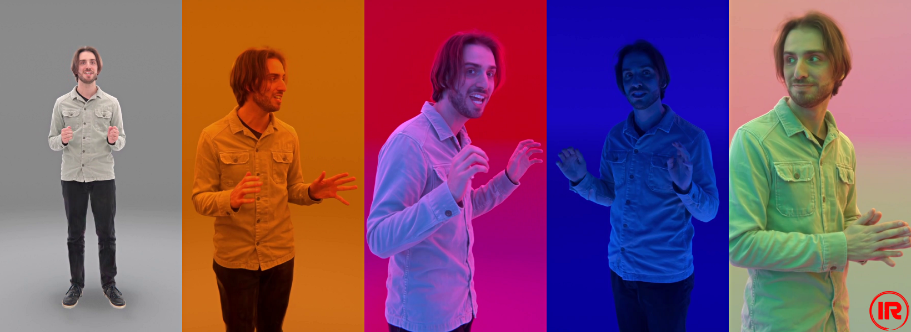

# Infinite-Realities Datasets

| [Project Page](https://infinite-realities-research.github.io/IR-Datasets/) | [Website](https://www.ir-ltd.net/) | [Youtube](https://www.youtube.com/@infiniterealities4D) |

## About
***A growing repository of quality datasets shared for research.***

Infinite-Realities is proud to present a curated collection of high-quality datasets for research purposes. 
Our datasets are designed to be used in a variety of applications, including radiance fields, neural rendering, dynamic gaussian splatting, machine learning and more.

To request access to the Infinite-Realities Datasets, please read the license agreement and complete [this form](https://docs.google.com/forms/d/e/1FAIpQLScxM9nBuaO5MZf7Gk1IY7hCowU4Kd-yREfCN5JNxlZPiqgOOA/viewform?usp=header).


## Human Datasets
[Michael Radiance Fields](https://github.com/Infinite-Realities-Research/IR-MichaelRadianceFields)

<p align="left">
  
</p>

## Object Datasets
*Coming soon*

## Citation

If you use our datasets in your research, please cite the main Infinite-Realities Datasets citation and the specific sub-dataset

```bibtex
@misc{ir2025datasets,
    author = {Infinite-Realities and Triplegangers and Perry-Smith, Lee and Pearce, Henry and Tomchuk, Oleksandr and Tomchuk, Kateryna},
    title = {Infinite-Realities Datasets},
    year = {2025},
    publisher = {Infinite-Realities},
    note = {GitHub repository},
    howpublished = {\url{https://infinite-realities-research.github.io/IR-Datasets/}}
}
```
